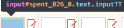

# Refined-Actitime

Adds default values when tracking time and hides unneccessary ui elements.

## Manual install

* Clone repo
* Goto chrome://extensions
* Drag 'extension' folder to chrome

## Configure default values

* Goto actitimes time tracking page (submit_tt.do)
* Use dev-tools to find the default task id by inspecting
a input field on the same row as your default project.

